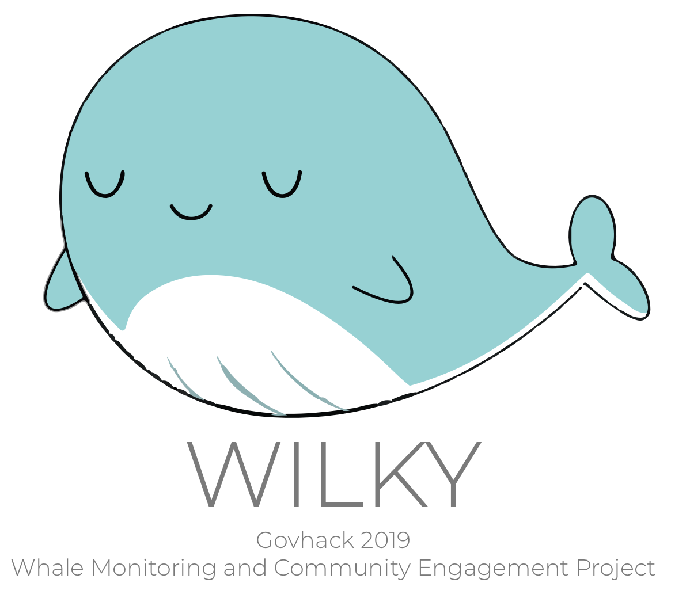
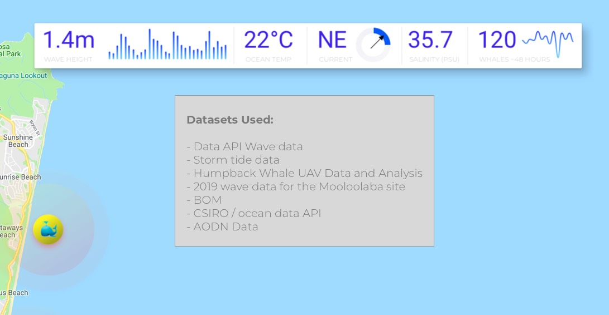
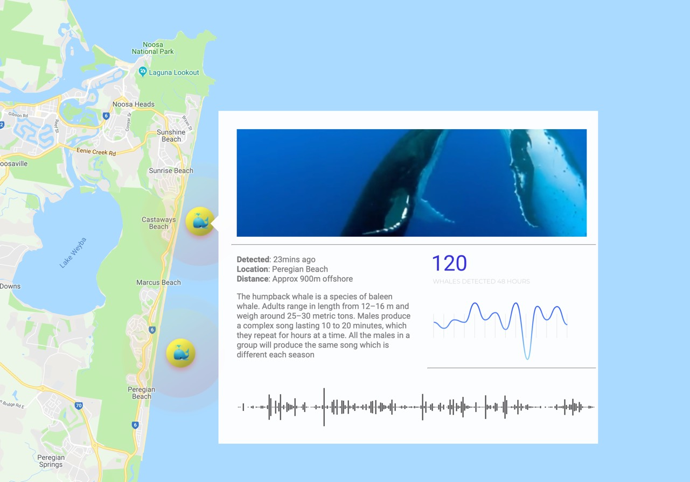
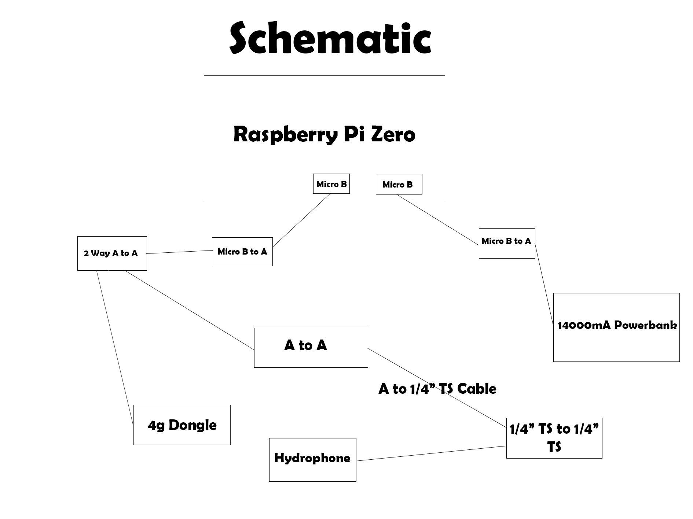
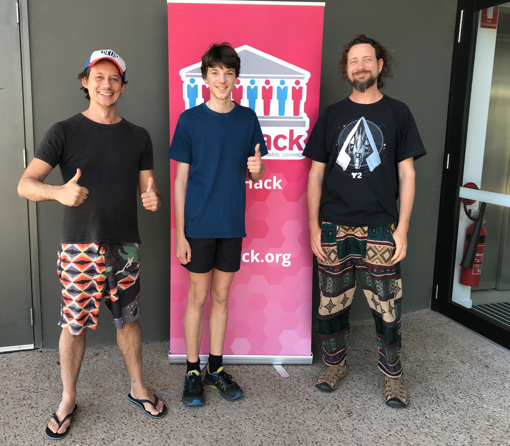

# Wilky the Whale

Govhack 2019 - Wilky the Whale UI concept

# Introduction

Enhancing community engagement with whales and our ocean environment. Using public API data from the QLD Government and the CSIRO to pull ocean temp, currents, salinity, weather and tidal information within the Wilky user-interface.

# Video

View the submission video on Youtube:

[https://www.youtube.com/watch?v=yqJ98tkXHGo&feature=youtu.be](https://www.youtube.com/watch?v=yqJ98tkXHGo&feature=youtu.be)

# API Datasets

Wilky uses various Govhack datasets to power the user-interface (WIP)

# App Portal

A demo instance of the [Wilky user-interface](https://benduncan.github.io/wilky-the-whale-ui/) is intended primarily for a interactive terminal installation not far from the main beach (e.g. town square). The installation will consist of an iPad mounted on a stand, which is accessible to the public to view and see in realtime whale sounds off the coast, and access QLD government and CSIRO data on ocean metrics.

# Slide Deck

A [slide](https://github.com/benduncan/wilky-the-whale-ui/blob/master/govhack-assets/wilky%20-%20GOVHACK%20NOOSA.pdf) for overview or video

# Hardware Planning

An initial [hardware](https://github.com/benduncan/wilky-the-whale-ui/blob/master/govhack-assets/hardware-planmning.md) planning document

# Hardware Spreadsheet

The info about the various hardware components are collated into a [spreadsheet](https://docs.google.com/spreadsheets/d/e/2PACX-1vS0axL6-YYMyzx2jE6wDurdhn4YheI0SrInnZA-kYepqKk4lEPqnQZkQgBLEOZMwNYaRXz1ZH2DWHhn/pubhtml). The hardware for initial prototype will cost about \$350 and will be assembled and tested in the coming weeks.

# Hardware Schematic

# Next Steps

Aiming to crowdfund the initial deployment in Peregian Beach, Queensland and deploy the first device August 2019, in time to catch the last month of the whale season. The fixture will be available each whale season, from July through to late October. Additional deployments are scheduled for Noosa and other Sunshine Coast beaches in 2020.

# Team

Gohack 2019, Peregian Beach team for `Project Wilky`

- Max Diamond
- Marco Grigull
- [Ben Duncan](https://twitter.com/ben_colo)
